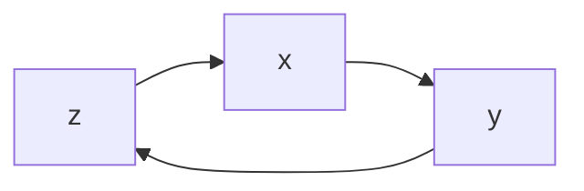

> A directed graphical model is a probabilistic model for which the [[conditional_independence]]  structure is encoded in a graph with arrows indicating direction. In a graphical model, vertices (or nodes) represent random variables, and the edges encode conditional independence relations among the associated vertices. The graph characterizes the way in which the joint distribution factors into the product of many small components, each of which contains only a subset of variables.

A simple directed graphical model is presented in this diagram:

Note that any graph

# References
John Lafferty, Han Liu, and Larry Wasserman (2010). [Directed Graphical Models](https://www.stat.cmu.edu/~larry/=sml/DAGs.pdf)

