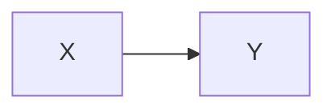
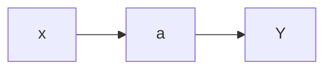

# Overview
This note provides an outline of causal graph basics.

## A change in variable `X` causes a change in variable `Y`


This is referred to as an open path

By constrast, a blocked path is

```mermaid
graph TD;
	X-->Z;
	Z<--Y; 
```

## `a` is a mediator between `X` and `Y`




## Collider variable


Colliders block transmission of cause-effect. 

