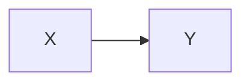
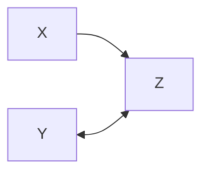
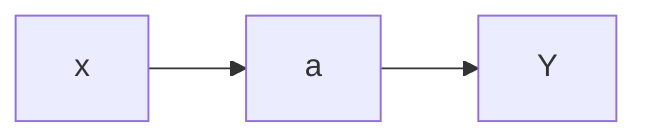
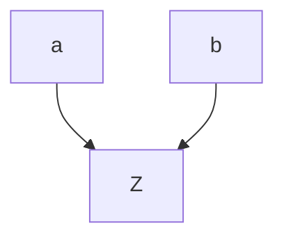
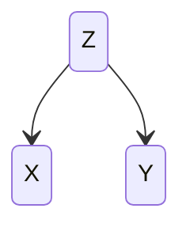

# Overview
This note provides an outline of causal graph basics.

## A change in variable `X` causes a change in variable `Y`

This is referred to as an open path between cause and effect

## Blocked path

## Mediator 

`a` is a mediator between `X` and `Y`

## Collider variable

In this example, $Z$ is a collider
## Confounders

In this example, $Z$ is a confounder, creating a spurious association between  $X$ and  $Y$. 