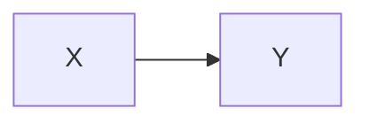
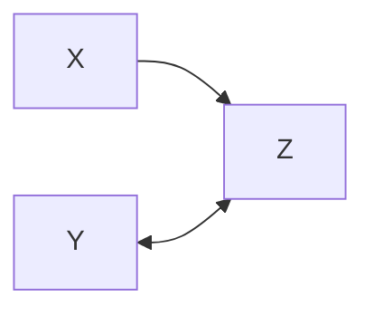
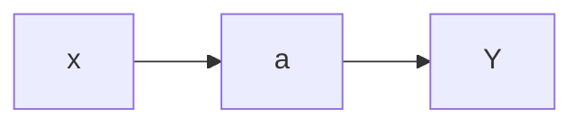
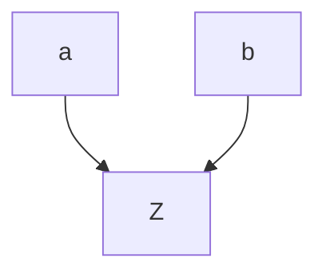
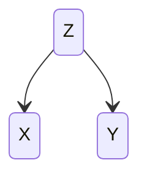

# Overview
This note provides an outline of causal graph basics. Rules of causal graphs:
- Causal graphs are acyclic. Logically, a variable cannot cause itself
- Open paths between variables can be blocked by conditioning on non-colliders
- Blocked paths between variables can be unblocked by conditioning on colliders.

## Open path

A change in variable $X$ causes a change in variable $Y$. This is referred to as an open path between cause and effect.

## Blocked path

## Mediator 

In this example, $a$ is a mediator between cause $X$ and effect  $Y$

## Collider variable

In this example, $Z$ is a collider
## Confounders

In this example, $Z$ is a confounder, creating a spurious association between  $X$ and  $Y$. This example is referred to as a `fork`. 

# Conditioning
