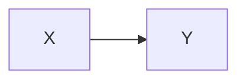
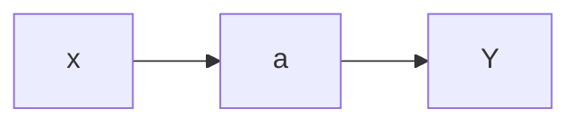
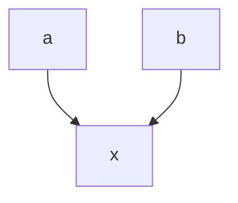

# Overview
This note provides an outline of causal graph basics.

## A change in variable `X` causes a change in variable `Y`

```mermaid
graph LR;
	X-->Y;
```

## Mediator variable

```mermaid
graph LR;

x --> a;
a --> Y;
```
## Collider variable

```mermaid
graph TD;
	a --> x;
	b --> x;
```