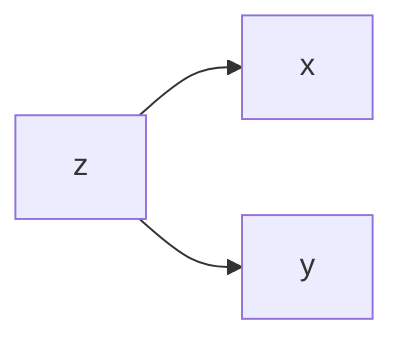

D-Separation describes conditional independence in [Directed Graphical Models](Directed%20Graphical%20Models.md). We can use this in order to determine relationships between random variables if only a subset of the model is observable.

The crucial point in conditional independence is the location of observable nodes in the Directed Graphical Model.

# d-separation rules
The rules of d-Separation:
1. When $Y$ is not a collider, $X$ and $Y$ are d-connected, but they are d-separated given $Z$. 
2. If $X$ and $Y collide at $Z$ then $X$ and $Y$ are d-separated, but they are d-connected given $Z$.
3. Conditioning on the descendant of a collider has the same effect as conditioning on the collider. 

# Using d-separation in analysis
Tips for using d-separation to identify cause-effect relationships:
- Mark the given variables
- Apply basic rules to all triplets
- Check if there is a path between random variables that is not blocked.

# References

[What is D-Separation? | Conditional Independence](https://youtu.be/mv5D2akH25w)

John Lafferty, Han Liu, and Larry Wasserman (2010). [Directed Graphical Models](https://www.stat.cmu.edu/~larry/=sml/DAGs.pdf)

